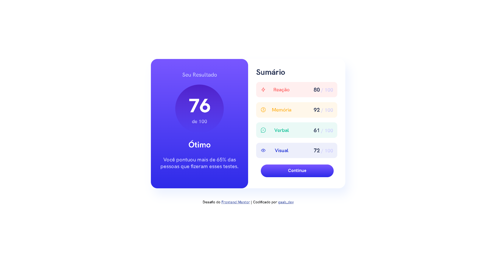

### Preview

    

## Visão geral
Esta é uma solução para o [desafio do componente de resumo de resultados no Frontend Mentor](https://www.frontendmentor.io/challengesresults-summary-component-CE_K6s0maV).

### Links
- URL do site ao vivo: [Frontend Mentor | Componente de resumo de resultados](https://gabyzinha72.github.io/results-summary-component/)

### Tecnologias
- HTML5
- CSS
- Flexbox
- Git e Github

## Autor
- Frontend Mentor - [@gabyzinha72](https://www.frontendmentor.io/profile/gabyzinha72)